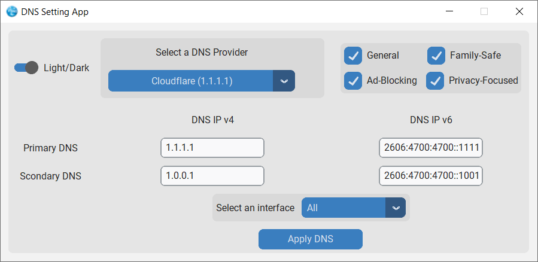

# DNS Setting App

A modern, user-friendly desktop application for managing DNS settings on Windows systems. Built with Python and CustomTkinter, this tool provides an intuitive interface to configure DNS servers across different network interfaces.

## Dark mode mode


## Light mode

## Features

### 🚀 **Easy DNS Management**
- **Automatic DNS**: Quickly revert to DHCP-assigned DNS servers
- **Pre-configured Providers**: Choose from a curated list of public DNS providers
- **Manual Configuration**: Enter custom DNS servers with full control

### 🎯 **Smart DNS Categories**
- **General DNS**: Standard public DNS providers (Google, Cloudflare, etc.)
- **Family-Safe**: DNS services with content filtering for family protection
- **Ad-Blocking**: DNS providers that block advertisements and trackers
- **Privacy-Focused**: Services focused on user privacy and data protection

### 🔧 **Advanced Features**
- **Multiple Interface Support**: Apply DNS settings to specific network interfaces or all interfaces
- **Dual Stack Support**: Configure both IPv4 and IPv6 DNS servers
- **Dark/Light Mode**: Toggle between dark and light themes based on system preference

### 📊 **Provider Information**
The application includes a comprehensive database of DNS providers with:
- Primary and secondary DNS addresses (IPv4 and IPv6)
- Categorized by service type and purpose
- Regularly updated provider information

## Installation

### Prerequisites
- Windows operating system
- Python 3.7 or higher
- Administrator privileges (required for DNS changes)

### Method 1: Standalone Executable
1. Download the latest release from the Releases page
2. Run `DNS_Setting_App.exe`

### Method 2: From Source
```bash
# Clone the repository
git clone https://github.com/Raisbeau/DNS-Setting-app.git
cd DNS-Setting-app

# Install dependencies
pip install -r requirements.txt

# Run the application
python DNS_SETTING_APP.py